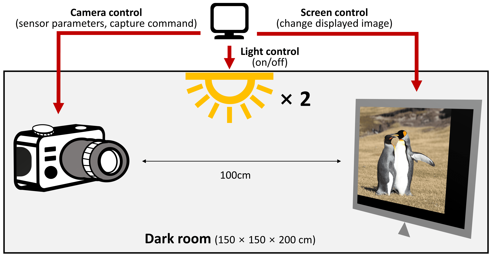
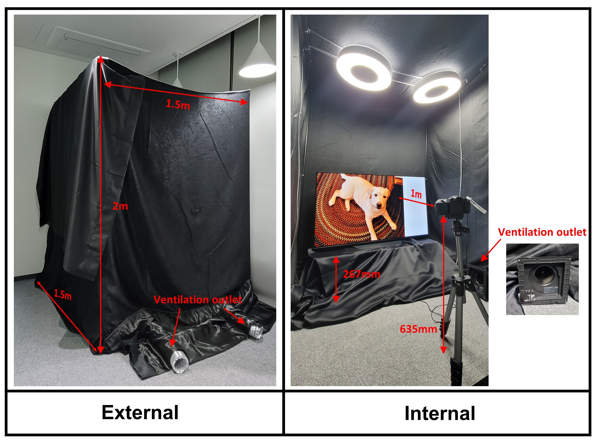

# Unexplored Faces of Robustness and Out-of-Distribution:  Covariate Shifts in Environment and Sensor Domains (CVPR 2024)

## ImageNet-ES 
 In contrast to conventional robustness benchmarks that rely on digital perturbations, we directly capture **202k images** by using a real camera in a controllable testbed. **The dataset presents a wide range of covariate shifts caused by variations in light and camera sensor factors.**
 
 [Download ImageNet-ES here](https://drive.google.com/file/d/1ZCsc4tw_aRNzWii8ahvKV97z3V3xzMDA/view?usp=sharing)


### ImageNet-ES strucuture
```
ImageNet-ES
├── es-train
│   └── tin_no_resize_sample_removed 
│   # 8K original validation samples of Tiny-ImageNet without references
├── es-val
│   ├── auto_exposure 
│   ├── param_control
│   └── sampled_tin_no_resize # reference samples (1K)
├── es-test
    ├── auto_exposure 
    ├── param_control
    └── sampled_tin_no_resize2 # reference samples (1K)
```
The main paper and the appendix explain more details about dataset specification.

## ES-Studio
To compensate the missing perturbations in current robustness benchmarks, we construct a new testbed, **ES-Studio** (**E**nvironment and camera **S**ensor perturbation **Studio**). It can control physical light and camera sensor parameters during data collection. 
- Collection modules via ES-Studio will be updated.




## Experiments
### Environment Setup (Will be merged)
We use PyTorch and other packages. Please use the following command to install the necessary packages:
```
conda create -n ies python=3.10
conda activate ies
conda install pytorch torchvision torchaudio pytorch-cuda=11.8 -c pytorch -c nvidia
cd ImageNet-ES/
pip install -r requirements.txt
```
```
conda create -n ies_dg python=3.9
conda activate ies_dg
conda install pytorch==2.0.1 torchvision==0.15.2 torchaudio==2.0.2 pytorch-cuda=11.8 -c pytorch -c nvidia
pip install timm==0.9.10 pandas==1.5.3 lpips opencv_python
```

### Datasets
Please prepare the datasets as following in the same directory.
- ImageNet: `ILSVRC12`
- ImageNet-C: `ImageNet-C`
- ImageNet-ES: `ImageNet-ES`
- CAE and EDSR: `CAE` and `EDSR`
    - You need to prepare the distorted datasets as described in [ImageNet-R repository](https://github.com/hendrycks/imagenet-r)

### OOD Detection 
Please follow below steps to produce the experimental results for 5.1 OOD Detection in the main paper and related parts in the appendix.
- [Step 1] Please prepare the following pretrained models with Tiny-ImageNet.
    - Swin : https://drive.google.com/file/d/1DKFkDSfC5s6XxvL8Bk8GWhOzsEiCiyd5/view?usp=drive_link
    - EfficientNet : https://drive.google.com/file/d/1YBBZJAcMPps8WB7bIgY6ssFWpkP27IGk/view?usp=drive_link
    - Resnet18 : https://drive.google.com/file/d/1WSrk_8SboeSh61a0_Kv4vgAKpUaI-Dm1/view?usp=drive_link
    - ViT : https://drive.google.com/file/d/1fj3Y8FvazE7mYRunDU2rc6QtndnyGbBz/view?usp=drive_link

- [Step 2] In configs/user_configs.py, please update the path information of pretrained models and ImageNet-ES directory.
    ```
    IMAGENET_ES_ROOT_DIR = 'path/to/root-dir/of/imagenet-es'
    SWIN_PT = "path/to/swin_model_weights/file"
    RESNET18_PT = 'path/to/resnet18_model_weight/file'
    EN_PT = "path/to/efficientnet_model_weight/file"
    VIT_PT = "path/to/vit_model_weight/file"
    ```
- [Step 3] Run scripts to download openood datasets (only once):
    ```
    sh utils/download.sh
    ```
- [Step 4] Run labeling scripts to adopt ImageNet-ES to [openood](https://github.com/Jingkang50/OpenOOD) evaluation api.
    ```
    python get_label_lists.py -model ${MODEL_NAME} -gpu_num {DEVICE_NUM} -bs ${BATCH_SIZE}
    ```

- [Step 5] Run OOD evaluator.
    ```
    python ood_exp.py -model ${MODEL_NAME} -gpu_num {DEVICE_NUM} -id_name ${ID_NAME} -output_dir {OUTPUT_DIR_NAME}
    ```
    - In configs/user_configs.py, you can specify target OOD processors which openood supports
        ```
        TARGET_OOD_POSTPROCESSORS = ['msp', 'odin', 'react', 'vim', 'ash']
        ```
    - The experimental results will be saved in {OUTPUT_DIR_NAME}/{MODEL_ARCHITECTURE_NAME} directory under following name: 'TIN2-{ID_NAME}_{OOD-PROCESSOR}_scores.pt' and 'TIN2-{ID_NAME}_{OOD-PROCESSOR}_results.pt'.

- [Step 6] Plot and analyze the results from Step 5 using the following Notebooks
    * [ood_plots.ipynb](https://github.com/Edw2n/ImageNet-ES/blob/main/ood_plots.ipynb): Analysis for ood experiments

- [Available Options for Step 4 and Step 5]
    * Available options of "MODLE_NAME" can be referenced by key of timm_config in configs/models/model_config.py.
    * Available options of "ID_NAME"
        * "SC" : Semantics-centric framework setting
        * "MC" : Model-specific framework setting
        * "ES" : Enhancement setting of "MC" with ImageNet-ES
    * Reference get_labeler_args and get_evalood_args in utils/experiment_setup.py for more options and details.

### Domain generalization techniques
Please follow below steps to produce the experimental results for 5.2 Domain Generalization in the main paper and related parts in the appendix.

- [Step 1] Please use the following command to run the experiments proposed in Table 2. We used a single GPU to train, and it is recommended to use `CUDA_VISIBLE_DEVICES=[GPU no.]`.
    
    ```
    CUDA_VISIBLE_DEVICES=0 python augment_analysis.py --data_root [DATASET DIRECTORY] -a resnet50 --seed [SEED] --epochs [NUM_EPOCHS] -b [BATCH_SIZE] --exp-settings [EXPERIMENT SETTING] --use-es-training (Optional)
    ```

    - Description of `exp-settings` argument:
        - 0 for compositional augmentation only (RandomCrop, RandomResize, RandomFlip)
        - 1 for basic augmentation (ColorJitter, RandomSolarize, RandomPosterize)
        - 2 for advanced augmentation (DeepAugment and AugMix)
        - If `use-es-training` is **not** used, 0,1 and 2 correspond to Experiment 1,2 and 3 in the paper, respectively
        - If `use-es-training` is used, 0,1 and 2 correspond to Experiment 4,5 and 6 in the paper, respectively

    - Description on `use-es-training` argument:
        - Use this argument to conduct experiment 4,5 and 6 in the paper
        - For example, `--exp-settings 0/1/2 --use-es-training` corresponds to experiment 4/5/6

    - The logs are stored in `aug_logs` directory under following name: `aug_experiments_{exp_settings}_{use-es-training}.txt`

    - The experimental results (Final test accuracy on ImageNet/ImageNet-C/ImageNet-ES) are stored in  `results` directory under folllowing name: `aug_experiments.txt`

    - Please refer to `aug_analysis.sh` file for the commands used for experiments.

    - All necessary datasets should be located in `data_root`: ImageNet, ImageNet-ES, ImageNet-C and CAE/EDSR(explained below).

    - Note that to use DeepAugment, you need to prepare the distorted datasets as described in [ImageNet-R repository](https://github.com/hendrycks/imagenet-r). The created dataset should be stored in `CAE` and `EDSR` directories under `data_root`.

- [Step 2] Identify and analyze the results from step 1 using following Notebook.
    * [dg_and_sensor_control_summary.ipynb](https://github.com/Edw2n/ImageNet-ES/blob/main/dg_and_sensor_control_summary.ipynb)

### Sensor Paramter Control
Please follow below steps to produce the experimental results for 5.3 Sensor Paramter Control in the main paper and related parts in the appendix.


- [Step 1] Evaluation of various models on ImageNet-ES (Table 3)
    
    Please use the following command to run the experiments proposed in Table 2. We used a single GPU for evaluation, and it is recommended to sue `CUDA_VISIBLE_DEVICES=[GPU no.]`.
    
    ```
    CUDA_VISIBLE_DEVICES=0 python imagenet_as_eval.py -a [MODEL ARCHITECTURE] -b [BATCH_SIZE] --pretrained --dataset [EVALUATION DATASET] --log_file [LOG FILE NAME]
    ```
    - Available model architectures (`-a` argument):
        - `eff_b0`: EfficientNet-B0
        - `eff_b3`: EfficientNet-B3
        - `res50`: ResNet-50
        - `res50_aug`: ResNet-50 trained with DeepAugment and AugMix (Need to download from [ImageNet-R repository](https://github.com/hendrycks/imagenet-r))
        - `res152`: ResNet-152
        - `swin_t`: SwinV2 Tiny
        - `swin_s`: SwinV2 Small
        - `swin_b`: SwinV2 Base
        - `dinov2_b`: DINOv2 Base
        - `dinov2`: DINOv2 Giant    

    - Available datasets (`--dataset` argument):
        - `imagenet-tin`: Subset of tiny that matches ImageNet-ES
        - `imagenet-es`: ImageNet-ES, Manual parameter settings
        - `imagenet-es-auto`: ImageNet-ES, Auto exposure settings
    - Other arguments:
        - `b`: Batch size used in the evaluation
        - `pretrained`: Use pretrained model weights downloaded from PyTorch (If you use --timm flag, the model weights downloaded from timm are used.)
        - `timm`: Use timm pretrained weights
        - `log_file`: The name of the log file. The logs are stored in `logs` directory under the following name: `logs_{model architecture}_{dataset}.txt`

    - The experimental results (ImageNet-ES test accuracy) are stored in `results` directory under folllowing name: `{model architecture}_{dataset}.csv`

    - Please refer to `eval_scripts.sh` file for the commands used for experiments.
- [Step 2] Identify and analyze the results from step 1 using the following Notebook.
    * [dg_and_sensor_control_summary.ipynb](https://github.com/Edw2n/ImageNet-ES/blob/main/dg_and_sensor_control_summary.ipynb)
- [Step 3] Explore direction of sensor control using the following notebook
    * [qualitative-analysis.ipynb](https://github.com/Edw2n/ImageNet-ES/blob/main/qualitative-analysis.ipynb)
    * Section 5.3.2 in the main paper and related parts in the appendix

### Citations
* To be updated soon
